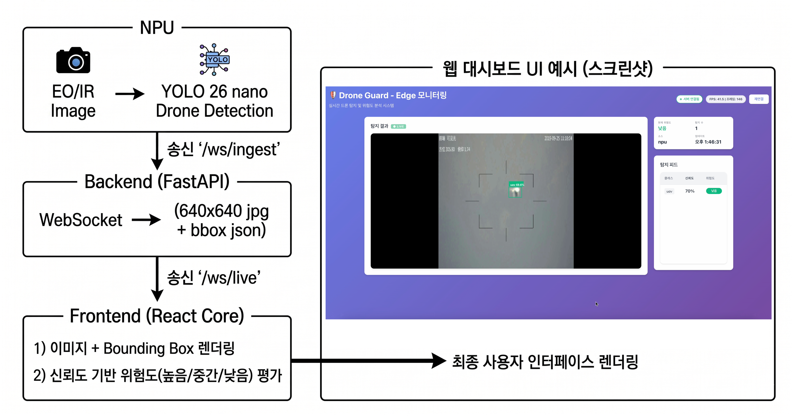
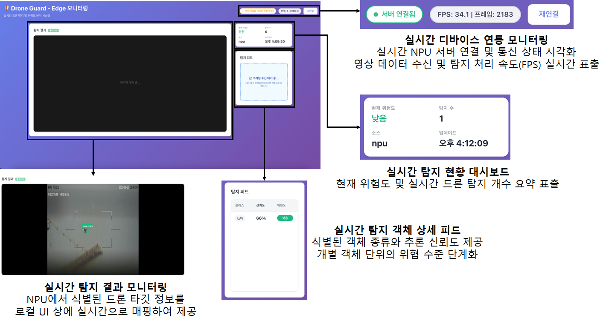

# Drone Guard — Frontend

**실시간 드론 탐지 및 위험도 분석 모니터링 웹 애플리케이션**

NPU 단말기에서 전송된 EO/IR 융합 탐지 결과를 WebSocket으로 수신하여 브라우저에서 실시간으로 렌더링하고, 자체 위험도 평가 로직을 통해 3단계 경보를 시각화합니다.

---

## 목차

1. [시스템 아키텍처](#시스템-아키텍처)
2. [서비스 구조](#서비스-구조)
3. [웹 화면](#웹-화면)
4. [프로젝트 구조](#프로젝트-구조)
5. [통신 명세](#통신-명세)
6. [설치 및 실행](#설치-및-실행)
7. [환경 변수](#환경-변수)
8. [주요 기능](#주요-기능)

---

## 시스템 아키텍처

```text
[NPU 단말기] ──(ws/ingest, DPX1 Binary)──► [FastAPI 백엔드] ──(ws/live, JSON)──► [React 프론트엔드]
  드론 탐지 추론                               파싱 · 브로드캐스트                    실시간 렌더링 · 위험도 평가
```

| 구성 요소 | 역할 |
|-----------|------|
| **NPU 단말기** | YOLO26nano로 드론 탐지 후 DPX1 바이너리 패킷을 백엔드로 전송 |
| **FastAPI 백엔드** (`server.py`) | DPX1 파싱 → JSON 변환 → 접속된 모든 웹 클라이언트에 브로드캐스트 |
| **React 프론트엔드** (`Dashboard`) | WebSocket 수신 → 캔버스 렌더링 → 위험도 자체 평가 · 시각화 |

---

## 서비스 구조



---

## 웹 화면



---

## 프로젝트 구조

```text
Drone-Guard-frontend/
├── public/                  # React 정적 템플릿 및 PWA 매니페스트
│   ├── index.html
│   ├── manifest.json
│   └── robots.txt
├── src/                     # React 소스 코드
│   ├── api/
│   │   └── wsClient.js      # WebSocket 연결 및 메시지 처리
│   ├── components/
│   │   ├── DetectionList.js
│   │   ├── DetectionViewer.js
│   │   └── RiskCard.js
│   ├── pages/
│   │   └── Dashboard.js
│   ├── utils/
│   │   └── riskCalculator.js # 위험도 계산 (3단계)
│   ├── App.js
│   └── index.js
├── build/                   # `npm run build` 후 생성되는 배포용 정적 파일
├── server/                  # FastAPI 백엔드
│   ├── server.py            # 서버 진입점
│   ├── cert.pem             # (선택) SSL/TLS 인증서
│   └── key.pem              # (선택) SSL/TLS 개인 키
├── .env                     # 환경 변수
└── package.json
```

> 프론트엔드 코드를 수정한 후 `npm run build`를 실행하면 `build/`에 배포용 정적 파일이 생성됩니다. `server.py`는 이 `build/` 폴더를 자동으로 서빙합니다.

---

## 통신 명세

### 1. NPU → 백엔드

- **Endpoint**: `ws://<서버IP>:8765/ws/ingest`
- **프로토콜**: Binary (DPX1 매직넘버)

```json
{
  "frame_seq": 1234,
  "image": { "w": 640, "h": 640, "size": 45000 },
  "detections": [
    { "class_name": "drone", "score": 0.95, "bbox": [180, 180, 460, 460] }
  ]
}
```

### 2. 백엔드 → 프론트엔드

- **Endpoint**: `ws://<서버IP>:8765/ws/live`
- **프로토콜**: JSON Text

```json
{
  "type": "frame",
  "frame_seq": 1234,
  "ts": 1716000000.0,
  "image": "data:image/jpeg;base64,...",
  "image_size": [640, 640],
  "detections": [
    { "class_name": "drone", "score": 0.95, "bbox": [180, 180, 460, 460] }
  ]
}
```

> `wsClient.js`는 수신 즉시 `bbox` 배열을 `{x1, y1, x2, y2}` 객체로 정규화하고 위험도 평가 로직을 실행합니다.

---

## 설치 및 실행

### 1. 프론트엔드 빌드

FastAPI 백엔드가 빌드 결과물을 서빙하므로, 코드 수정 후 반드시 빌드를 먼저 실행해야 합니다.

```bash
# 의존성 설치
npm install

# 프로덕션 빌드 생성
npm run build
```

### 2. 백엔드 실행

```bash
# 의존성 설치
pip install fastapi "uvicorn[standard]" websockets

# 서버 실행
python .\server\server.py
```

### 3. 대시보드 접속

| 접속 환경 | 주소 |
|-----------|------|
| 로컬 | `http://localhost:8765/` |
| 외부 단말 (동일 네트워크) | `http://<서버IP>:8765/` |
| SSL 활성화 시 | `https://localhost:8765/` |

> **NPU 장비**는 `ws://<서버IP>:8765/ws/ingest`로 데이터를 전송해야 합니다.

### SSL/WSS 활성화

`server/` 디렉터리에 `cert.pem`, `key.pem`이 존재하면 자동으로 HTTPS/WSS 모드로 전환됩니다.

```bash
openssl req -x509 -newkey rsa:2048 -nodes \
  -keyout server/key.pem \
  -out server/cert.pem \
  -days 365 \
  -subj "/CN=localhost"
```

---

## 환경 변수

```env
# React 개발 서버 바인딩 (로컬 개발용)
HOST=0.0.0.0

# WebSocket 포트 및 API 주소 (server.py와 일치해야 함)
REACT_APP_API_URL=http://localhost:8765
REACT_APP_WS_PORT=8765
```

---

## 주요 기능

### 실시간 WebSocket 통신

- NPU 데이터가 **2초 이상 수신되지 않으면** 상태 배지가 **"서버 연결됨 (NPU 신호 없음)"** 으로 자동 전환
- 접속 시 호스트네임을 자동 감지하여 WebSocket URL을 동적으로 구성

### 드론 탐지 및 위험도 시각화

| 위험 등급 | 기준 |
|-----------|------|
| **HIGH** | 높은 신뢰도 + 넓은 Bounding Box 면적 |
| **MEDIUM** | 중간 신뢰도 또는 중간 면적 |
| **LOW** | 낮은 신뢰도 + 좁은 면적 |

- 원본 이미지의 비율을 유지하며 컨테이너 크기에 맞춰 Bounding Box를 동적으로 렌더링
- 위험도 평가는 `riskCalculator.js`에서 프론트엔드 단독으로 수행

### SSL/WSS 지원

`server/` 내에 인증서 파일이 있으면 자동으로 보안 서버로 전환되어 외부 모바일 기기 및 다른 PC에서의 접속을 지원합니다.

---

## 개발 팁

- **React 코드 수정 시**: `npm run build` 후 브라우저를 새로고침(F5)하면 즉시 반영됩니다. 백엔드를 재시작할 필요가 없습니다.
- **NPU 없이 UI 테스트**: `src/api/wsClient.js`의 내부 로직을 수정하여 로컬 루프백 테스트를 진행할 수 있습니다.

---

